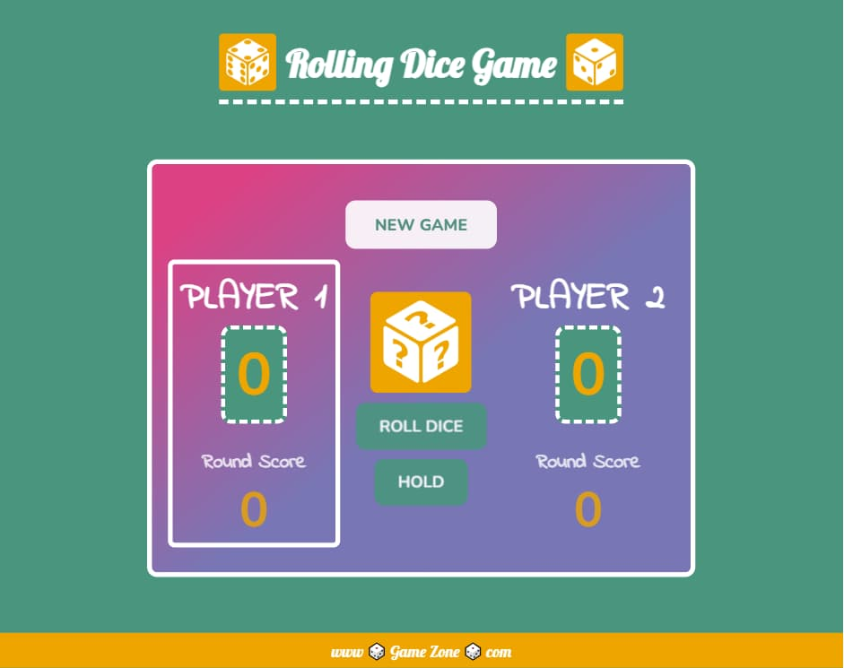

### javascript-dice-game

# 🎲 Dice Game 🎲

## Table of contents

- [Project Title](#dice-game)
- [Overview](#overview)
- [The Project](#the-project)
- [Installation Instructions](#game-rules)
- [Technology stack](#technology-stack)
- [Links](#links)
- [Visuals](#visuals)
- [Project Status](#project-status)
- [Author](#author)

## Overview

### The Project

A responsive, fun game of dice.

### Game Rules:

### Technology stack

- HTML
- CSS
- JavaScript

### Links

- Source code repository URL: [Github](https://github.com/basiacarvalho/javascript-dice-game)
- Live Site URL: [Live demo](https://basiacarvalho.github.io/javascript-dice-game/)

### Visuals

#### Tablet and Desktop view :

### Project Status

- Completed (with the possiblity for future adaption)\
  The basic concepts of the project have been met, however further ideas may be implemented and added in the future.

### Author

👩‍💻 The Dice Game is the result of taking part in a course on Udemy: 'The Complete JavaScript Course 2025: From Zero to Expert!' by Jonas Schmedtmann. The Java Script code comes from the course content.
To the general structure of the HTML code from the course I added my 'header' and 'footer'. The entire style and the responsiveness of the App was done by me (Barbara Carvalho).

